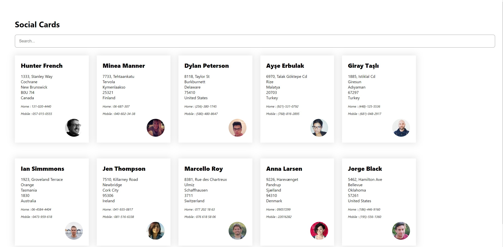

---

## 새로 배운 것들

---

### `useEffect`에 `async` 사용하기

```javascript
useEffect( async () => {} )
```

실제로 `useEffect`에 이런 식으로 `async`를 사용하는 것은 불가능하다. 그렇다면 `useEffect` 내부에 비동기가 필요한 경우 어떻게 코드를 작성할 수 있을까.

기존에 내가 아는 방법은, 내부에 비동기 함수를 선언하고 맨 마지막에 실행시키는 식으로 코드를 작성하는 것으로만 알고 있었다.

```javascript
useEffect( () => {
	async function foo() {
	    const data = await fetch();
	}
	foo();
})
```

그런데!! 이번에 알게 된 사실이 즉시 실행 함수로 이 부분을 대신 할 수 있다는 것을 알게 되었다. 내 생각에 즉시 실행 함수를 사용하는 것이 더 코드가 깔끔한 것 같다. 때문에 앞으로도 비슷하게 사용하면 좋지 않을까 싶다.

```javascript
// 실제 해당 프로젝트에서 사용한 코드

useEffect(() => {
    (async () => {
      try {
        const response = await fetch("https://randomuser.me/api/?results=10");
        const json = (await response.json()).results;
        console.log(json);
        setUsers(json);
        setAllUsers(json);
      } catch (errors) {
        console.log(errors);
        setUsers([]);
      }
    })();
  }, []);
```

---

### 한 줄 코드 내부에서 우선순위 정하기

```javascript
const json = (await response.json()).results;
```

api 콜을 통해 데이터를 받아오고 여기에서 results 부분만이 필요한 상황이다.

만약에 `const json = await response.json().results;` 이런 식으로 코드를 작성한다면? 에러가 난다.  response가 아직 undefined인 상태에서 results 값을 조회하게 되기 때문이다. 때문에 해당 부분이 먼저 수행될 수 있도록 소괄호를 치고 이후에 results 값을 조회하면 에러가 나지 않는다.

---

### 리액트에서 간단한 디바운스 구현하기

상단에 input box 활용을 통해 원하는 사람의 카드를 찾을 수 있다.

뭐 굳이 디바운스를 이곳에 써야만 하는 이유는 없지만, 연습사마 찾아서 적용시켜 보았다.

```javascript
// 디바운스를 적용하지 않은 코드

const filterCards = (e) => {
	 const value = e.target.value.toLowerCase();
     const filteredUsers = allUsers.filter((user) =>
       `${user.name.first} ${user.name.last}`.toLowerCase().includes(value)
     );
     setUsers(filteredUsers);
  };
```

```javascript
// 디바운스를 적용한 코드

 const [timer, setTimer] = useState(0); // 디바운싱 타이머
 
 const filterCards = (e) => {
    if (timer) {
      console.log("clear timer");
      clearTimeout(timer);
    }

    const newTimer = setTimeout(() => {
      const value = e.target.value.toLowerCase();
      const filteredUsers = allUsers.filter((user) =>
        `${user.name.first} ${user.name.last}`.toLowerCase().includes(value)
      );
      setUsers(filteredUsers);
    }, 800);

    setTimer(newTimer);
  };
```

이런 식으로 타이머 state를 하나 두고 이 값을 관리해가면서 디바운스를 구현할 수 있다.

이벤트가 발생할 때마다 이전의 이벤트는 지우고 0.8ms의 이벤트를 새로 다는 방식이다.

이 템플릿 코드가 나중에도 큰 도움이 될 수 있겠다라는 생각이 든다.

참고문헌: https://velog.io/@tjdud0123/%EB%A6%AC%EC%95%A1%ED%8A%B8-%EB%94%94%EB%B0%94%EC%9A%B4%EC%8B%B1-%EA%B0%84%EB%8B%A8-%EA%B5%AC%ED%98%84-react-debounce

